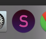
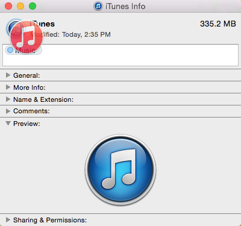

# Sublime Text Icon for Mac

*Stars and Forks are welcome :)*

Changing an item's icon
-------

- Use Finder to navigate to the Applications folder of your Mac and select the application for which you want to change the icon.

- Right-click the application and select ‘Get Info’ (or press ⌘I on your keyboard).

- In the top left corner of the Info panel, you’ll see the app’s icon. From here, drag the new icon file over the original. Drop it when you see the green + bubble on your cursor.

Alternatively, you can right-click on the new icon file and choose “Copy”, or select the file and press ⌘C. Return to the Info panel, highlight the original icon in the top left corner, and press ⌘V to paste.

Note: OS X may ask you for your administrative password at this point; enter it to paste the icon.

- If the application is already in your Dock, the new icon may not show up until you log out. To fix this, open Terminal (Applications > Utilities > Terminal), type “killall Dock” (without quotes), and press Enter.

How to revert back to the original icon
-------

If, for whatever reason, you decide to switch back to the app’s original icon, you can easily do so.

- Use Finder to navigate to the Applications folder of your Mac and select the app for which you want to revert the icon.

- Right-click the application and select ‘Get Info’ (or press ⌘I on your keyboard).

- In the top left corner of the Info panel, you’ll see the app’s icon. Click on it to highlight it.

- Press Backspace. The app’s icon should be restored to its original state.

Note: OS X may ask you for your administrative password at this point; enter it to reset the icon.

Thanks for read it!